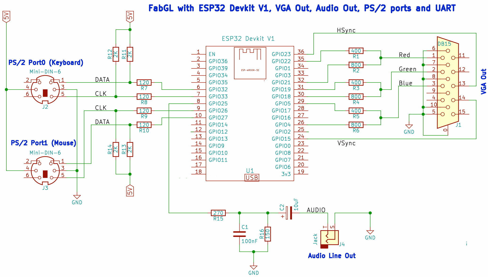
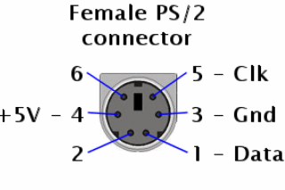
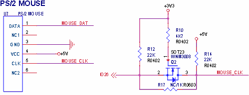

# Tiny MCUME esp81
Modificación del emulador MCUME zx81 (Jean MarcHarvengt) a la placa TTGO VGA32 v1.0, v1.1, v1.2 y v1.4 con ESP32.
 

He realizado varias modificaciones:
<ul> 
 <li>No se usa PSRAM, funcionando en ESP32 de 520 KB de RAM (TTGO VGA32 v1.x)</li> 
 <li>Uso de un sólo core</li>
 <li>OSD de bajos recursos</li>
 <li>Creado proyecto compatible con Arduino IDE y Platform IO</li> 
 <li>Se puede usar cualquier pin digital para el video (hardware.h)</li> 
 <li>Menú de velocidad de video de emulación, VGA, teclado</li>
 <li>Soporte para modo 64 colores (DAC 6 bits) y 8 colores (DAC 3 bits).</li>    
 <li>VGA 320x200 y 360x200 de bitluni, así como 320x200 con parámetros de fabgl</li>
 <li>Opción de eliminar el cálculo de redondeo IEEE (double) de la VGA</li> 
 <li>Carga de ficheros pfiles</li>
 <li>No se requiere la libreria de bitluni completa. He reducido a lo mínimo, ahorrando RAM y FLASH, basado en la librería de Ricardo Massaro</li> 
 <li>Soporte modo Hi-res y pseudo hi-res</li> 
 <li>Soporte CVBS PAL NTSC Blanco y Negro en placa TTGO VGA32 (pin 26 CLK PS/2)</li>
 <li>El modo CVBS por defecto no tiene borde y sale en modo invertido de color, para que se puede ver en el mayor número de TV sin problemas.</li>
 <li>Proyecto compatible con Web Editor y ArduinoDroid (6.3.1) con tool makeandroid.bat</li>
 <li>El OSD se muestra con la tecla <b>F1</b></li>
 <li>Añadido soporte de teclado desde terminal serie usb, monitor VStudio o putty.</li>
 <li>
   Teclado mapeado
   <pre>
 //Keyboard Matrix
 // Port____Line____Bit__0____1____2____3____4__
 // FEFEh  0  (A8)     SHIFT  Z    X    C    V
 // FDFEh  1  (A9)       A    S    D    F    G
 // FBFEh  2  (A10)      Q    W    E    R    T
 // F7FEh  3  (A11)      1    2    3    4    5
 // EFFEh  4  (A12)      0    9    8    7    6
 // DFFEh  5  (A13)      P    O    I    U    Y
 // BFFEh  6  (A14)    ENTER  L    K    J    H
 // 7FFEh  7  (A15)     SPC   .    M    N    B 
   </pre>
 </li>
</ul>

  
<h1>Versión precompilada</h1>
En la carpeta precompile se encuentran varias versiones ya compiladas para poder ser grabada con el flash download tool 3.9.2. con los juegos de demostración en FLASH.  
<a href='https://github.com/rpsubc8/ESP32TinyMCUMEesp81/tree/main/ESP32/precompile'>https://github.com/rpsubc8/ESP32TinyMCUMEesp81/tree/main/ESP32/precompile</a>
  
Debemos de elegir el tipo ESP32:

Posteriormente, seleccionaremos los archivos tal y como la captura adjunta, con los mismos valores de offset:

Y le daremos a start. Si todo ha sido correcto, sólo tendremos que reiniciar el ESP32.

  
<h1>Requerimientos</h1>
Se requiere:
 <ul>
  <li>TTGO VGA32 v1.x (1.0, 1.1, 1.2, 1.4)</li>
  <li>Visual Studio 1.66.1 PLATFORMIO 2.5.0 Espressif32 v3.5.0</li>
  <li>Arduino IDE 1.8.11 Espressif System 1.0.6</li>  
  <li>Librería reducida Arduino bitluni 0.3.3 (incluida en proyecto)</li>
 </ul>

 
 

  
<h1>ArduinoDroid</h1>
Se debe ejecutar, sólo una vez, el script makeandroid.bat, que nos deja toda la estructura de datos del directorio dataFlash en el directorio raiz, así como reemplazando las archivos principales con llamadas de los .h sin usar el directorio de datos dataFlash. 
Al finalizar, el propio script, termina borrando el directorio dataFlash. 
El script utiliza el fart.exe (find and replace text). 
Una vez, se haya ejecutado con éxito, se puede usar con el ArduinoDroid.

  
<h1>Arduino Web Editor</h1>
Se debe ejecutar, sólo una vez, el script makeandroid.bat. Una vez finalizado, se sube a la nube como un proyecto cualquiera, ya sea comprimido en zip o por archivos.

 
<h1>PlatformIO</h1>
Se debe instalar el PLATFORMIO 2.5.0 desde las extensiones del Visual Studio. Se requiere también Espressif32 v3.5.0. 

Luego se seleccionará el directorio de trabajo <b>TinyMCUMEesp81ttgovga32</b>.
Debemos modificar el fichero <b>platformio.ini</b> la opción <b>upload_port</b> para seleccionar el puerto COM donde tenemos nuestra placa TTGO VGA32, si por algun motivo no nos lo detecta.

Luego procederemos a compilar y subir a la placa. No se usa particiones, así que debemos subir todo el binario compilado.
Está todo preparado para no tener que instalar las librerias de bitluni ni fabgl.

  
<h1>Arduino IDE</h1>
Todo el proyecto es compatible con la estructura de Arduino 1.8.11.
Tan sólo tenemos que abrir el <b>MECUMEesp81.ino</b> del directorio <b>MECUMEesp81</b>.

Debemos instalar las extensiones de spressif en el gestor de urls adicionales de tarjetas <b>https://dl.espressif.com/dl/package_esp32_index.json</b>
 
Ya está preparado el proyecto, de forma que no se necesita ninguna librería de bitluni ni fabgl.
Debemos desactivar la opción de PSRAM, y en caso de superar 1 MB de binario, seleccionar 4 MB de partición a la hora de subir. Aunque el código no use PSRAM, si la opción está activa y nuestro ESP32 no dispone de ella, se generará una excepción y reinicio del mismo en modo bucle.

  
<h1>Modo Hi-res</h1>

  
<h1>Teclado UART</h1>
Se se activa la opción <b>use_lib_keyboard_uart</b>, se permite usar el teclado del PC desde el monitor VStudio o desde el putty (115200 bauds), de manera simple, dado que no es mediante lectura SCANCODE down, up:
<ul>
 <li><b>Tecla TAB o tecla F2:</b> Muestra OSD</li>  
 <li><b>Space:</b> Barra espaciadora</li>
 <li><b>ENTER</b>: Envía ENTER en el ZX81</li>
 <li><b>+:</b> Envia ALT_GR</li>
 <li><b>-:</b> Envia SHIFT LEFT</li>
 <li><b>.:</b> Envia .</li> 
 <li><b>Arriba:</b> SHIFT + 7 y Kempston Arriba</li>
 <li><b>Abajo:</b> SHIFT + 6 y Kempston Abajo</li>
 <li><b>Derecha:</b> Kempston derecha</li>
 <li><b>Izquierda:</b> Kempston izquierda</li>
 <li><b>A..Z, a..z: </b> a..z</li> 
 <li><b>0..9: </b> 0..9</li>
</ul>
Desde el Arduino IDE, no se permite dicha funcionalidad, dado que el monitor serie requiere el envio del ENTER por cada acción.

  
<h1>Opciones</h1>
El archivo <b>gbConfig.h</b> se seleccionan las opciones:
<ul> 
 <li><b>use_lib_vga8colors:</b> Obliga a usar RGB modo de 8 colores (3 pines). Saca 8 colores, frente a los 64 del modo normal (6 pines RRGGBB).</li>   
 <li><b>use_lib_log_serial:</b> Se envian logs por puerto serie usb</li> 
 <li><b>use_lib_keyboard_poll_milis:</b> Se debe especificar el número de milisegundos de polling para el teclado.</li> 
 <li><b>gb_delay_emulate_ms:</b> Milisegundos de espera por cada frame completado.</li>
 <li><b>use_lib_delay_tick_cpu_auto:</b> Si está a 1, la CPU se autoajusta a 20 ms por frame.</li>
 <li><b>use_lib_delay_tick_cpu_milis:</b> Si use_lib_delay_tick_cpu_auto está a 0, lo que definamos aqui, será la espera en milisegundos por frame.</li>
 <li><b>FIX_PERIBOARD_NOT_INITING:</b> Solución realizada por <b>dcrespo3D</b> para la inicialización en algunos teclados.</li>
 <li><b>use_lib_cvbs_bitluni:</b> Si está activo, no usa código de VGA, ni genera salida VGA. Usa la librería modificada de CVBS Bitluni. Si está comentado, usa todo el código de VGA. En la placa TTGO VGA32 se está usando el pin 26, es decir, el CLK del conector PS/2 del ratón.</li>
 <li><b>use_lib_cvbs_bitluni_not_backbuffer:</b> No usa el doble buffer en CVBS, ahorrando memoria. Puede ocasionar defectos visuales (flickering).</li>
 <li><b>use_lib_cvbs_pal:</b> Si está activo junto con use_lib_cvbs_bitluni, la salida de video será en norma PAL, sino NTSC.</li>
 <li><b>use_lib_cvbs_ttgo_vga32:</b> La placa TTGO VGA32 utiliza una salida de 5 voltios, en lugar de 3v. Por tanto se debe tener descomentada dicha línea si se usa la salida de TV, para poder reducir a 1 voltio la salida del DAC.</li>
 <li><b>use_lib_cvbs_ttgo_vga32_bright:</b> Si la salida del DAC en la TTGO VGA32 de 5v, es muy bajo, si se activa esta opción se puede incrementar un poco el brillo. Usar con cuidado, dado que la norma CVBS es de 1 voltio.</li>
 <li><b>use_lib_invert_color_default_value:</b> Permite la inversión de color, es decir, blanco por negro. En el modo CVBS por defecto está invertido. Sus valores son 1 o 0.</li>
 <li><b>use_lib_stats_time_unified</b> Permite ver trazas por el puerto serie con los fps, así como microsegundos actuales, mínimos y máximos por frame. Lo mismo para el video.</li>
 <li><b>use_lib_fix_double_precision</b> No usa el cálculo de frecuencia de video VGA con el propio ESP32, evitando posibles problemas de precisión con la mantisa. Es útil para ESP32's que calculen mal la frecuencia.</li>
 <li><b>use_lib_debug_i2s</b> Traza con los cálculos del modo de video.</li>
 <li><b>use_lib_vga360x200x70hz_bitluni</b> Modo de video 360x200 con los parámetros de bitluni.</li>
 <li><b>use_lib_vga320x200x70hz_bitluni</b> Modo de video 320x200 con los parámetros de bitluni.</li>
 <li><b>use_lib_vga320x200x70hz_fabgl</b> Modo 320x200 con los parámetros de fabgl.</li>
 <li><b>use_lib_border_x</b> Desplaza en múltiplos de 4 pixels la pantalla, útil para el modo de video 360x200. No exceder el valor 10, ya que se saldría del buffer.</li>
 <li><b>use_lib_keyboard_uart:</b> Permite usar el teclado del PC desde el PC por terminal monitor VStudio o desde el putty, sin falta de tener teclado. Útil para no tener que usar el teclado físico PS/2 y para desarrollo.</li>
 </ul>

  
<h1>DIY circuito</h1>
Si no queremos usar una placa TTGO VGA32 v1.x, podemos construirla siguiendo el esquema de <b>fabgl</b>:

Para el caso de querer salida de video cvbs, en lugar de VGA, debemos de sacar un cable directo del pin 26 del conector PS/2 del ratón, activando la opción <b>use_lib_cvbs_pal</b>, así como <b>use_lib_cvbs_ttgo_vga32</b> del <b>gbConfig.h</b>. Si no activamos dicha opción, la salida será de más de 1 voltio, teniendo que ser reducida con un reductor de voltaje (potenciómetro).

El conector de PS/2 es visto desde el propio jack de la placa, es decir, jack hembra. El pin en PS/2 es el CLK, es decir, el 5.

En esta imagen se puede ver el mosfet SOT23 interno de la placa TTGO VGA32, de manera, que la salida en CLK (pin 5) es 5 voltios.
 
 
 
  
<h1>Test DAC cvbs</h1>
Para TTGO VGA32 como la salida es 5v, o hacemos reducción de voltaje o podemos reducir la escala del DAC. En 3.3v de salida, con máximo el valor de 77, ya nos daría 0.99v, que sería 1v. Si tenemos 5v de salida, con 50, ya tenemos 0.97v, que sería 1v. De esta forma, ya no necesitamos resistencias reductoras, es el cable directo. Mientras no nos pasemos de 77 en 3.3v o 50 en 5v, no tendremos problema, sobre todo si sólo necesitamos 2 colores (blanco y negro).
Podemos hacer pruebas con un multímetro, sobre todo en la TTGO VGA32 v1.x:
<pre>
//ESP32 Pin 26
//DAC - Voltaje
//  0 - 0.06
// 38 - 0.52
// 77 - 1
//255 - 3.17

#include <Arduino.h>
#include <driver/dac.h>

const int arrayValue[4]={0,38,77,255};
unsigned char cont=0;

void setup() {
 Serial.begin(115200);
 dac_output_enable(DAC_CHANNEL_2);
}

void loop() {
 dac_output_voltage(DAC_CHANNEL_2, arrayValue[cont]);
 Serial.printf("%d\n",arrayValue[cont]);
 delay(4000);
 cont++;
 cont &= 0x03;
}
</pre>
Los valores máximos al escribir en el buffer de video en una placa ESP32 es de 54, mientras que para TTGO VGA32 v1.x sería de 35.
 
 
 

  
<h1>Tool p2h</h1>
He creado una herramienta muy básica, para convertir los archivos .p en .h en modo lista para ser procesados por el emulador. Tan sólo tenemos que dejar los archivos .p en la carpeta <b>input\pfile</b> y ejecutar el archivo <b>p2h.exe</b>, de forma que se generará una salida en el directorio <b>dataFlash</b>. Para pruebas, se ha dejado un archivo en el directorio <b>pfile</b>, que se recomienda borrar en caso de realizar una nueva lista personalizada. También se recomienda borrar los archivos del directorio <b>MECUMEesp81\dataFlash\pfile</b> para tener un proyecto limpio.  
<a href='https://github.com/rpsubc8/ESP32TinyMCUMEesp81/tree/main/tools'>Tool p2h</a>
  
<pre>
 input/
  pfile/ 
 output/
  dataFlash/
   pfile/
</pre>
Posteriormente debemos copiar el directorio <b>dataFlash</b> en el proyecto <b>TinyMCUMEesp81ttgovga32\MECUMEesp81</b> sobreescribiendo la carpeta dataFlash previa. Se recomienda limpiar el proyecto y volver a compilar. 
Esta herramienta es muy simple, y no controla los errores, por lo que se recomienda dejarle los archivos con nombres muy simples y lo más sencillo posible. 
El proyecto en PLATFORM.IO está preparado para 2 MB de Flash. Si necesitamos los 4MB de flash, tendremos que modificar la entrada del archivo <b>platformio.ini</b>
<pre>board_build.partitions = huge_app.csv</pre>
En el Arduino IDE, debemos elegir la opción <b>Partition Scheme (Huge APP)</b>.
